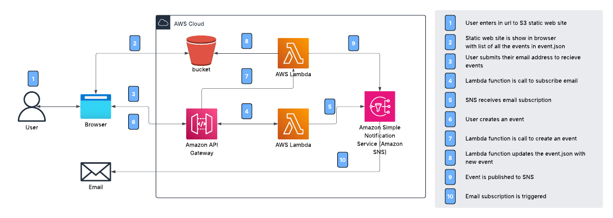
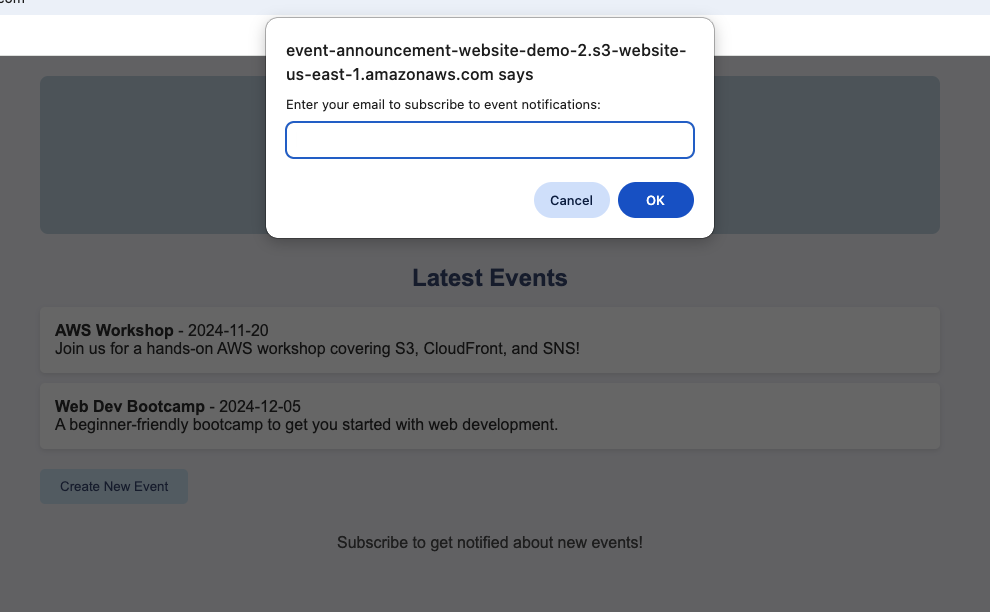
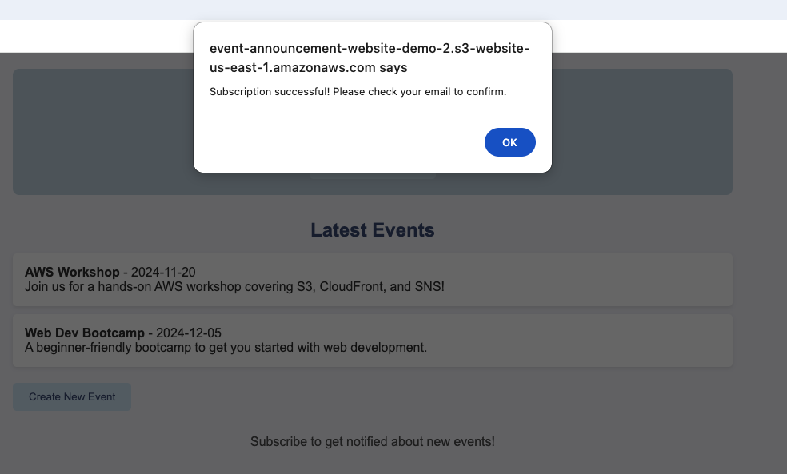
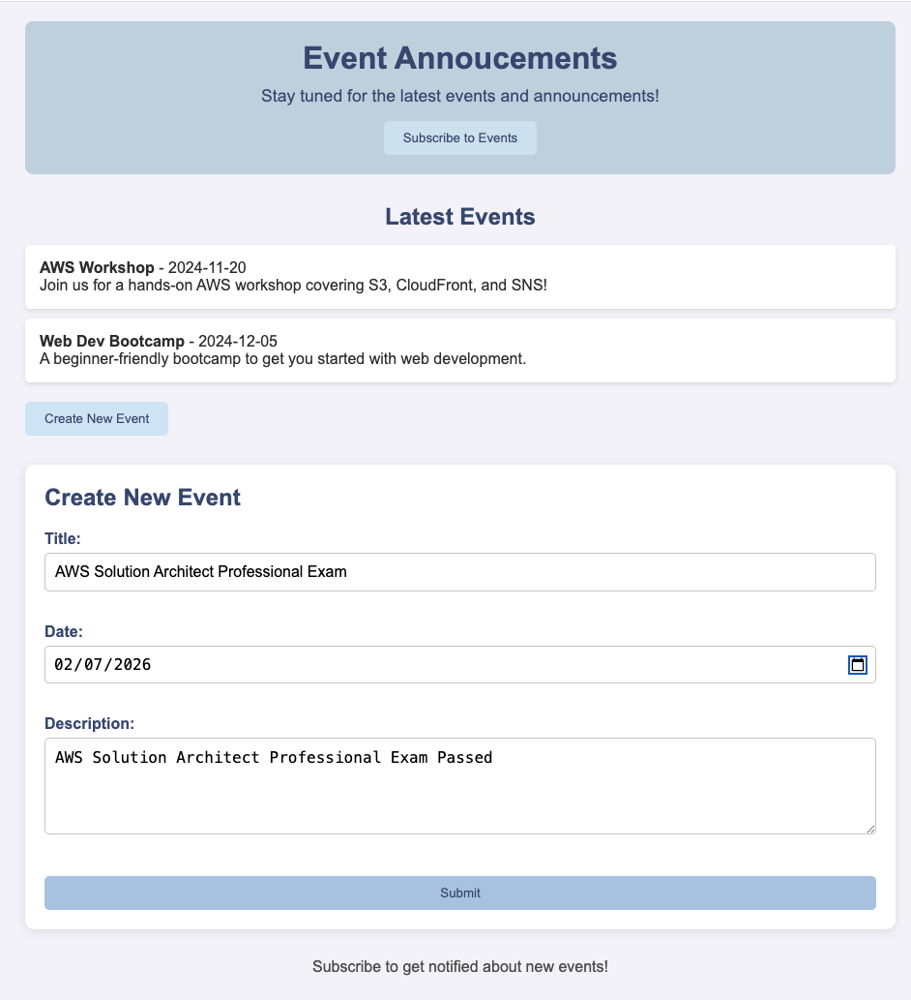
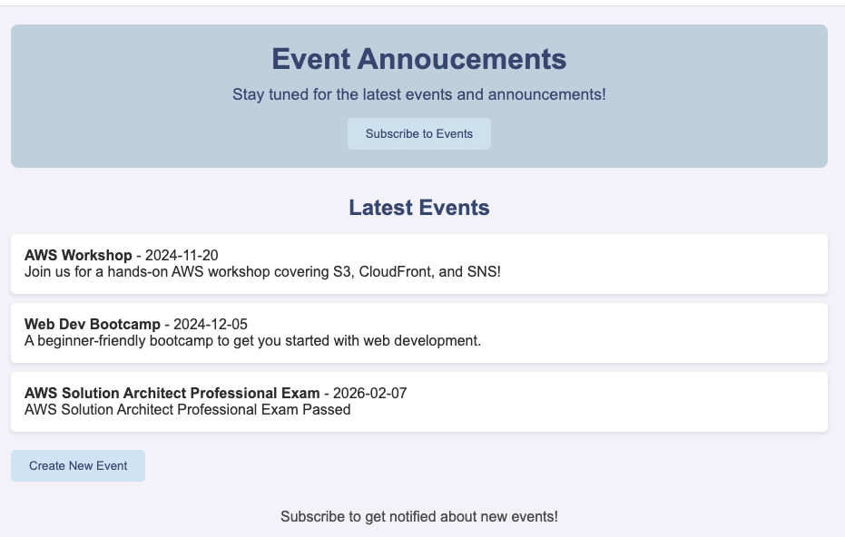

# Event Announcement System

## 🌟 Overview
Develop an event announcement website that allows users to:
* Subscribe to event notifications via email.
* View a list of events.
* Create new events through a form.

## 🛠️ Services Used
* **AWS S3**: Host the frontend and store event data in a JSON file. **[Frontend Hosting & Storage]**
* **AWS SNS**: Manage email subscriptions and send event notifications. **[Notifications]** 
* **AWS Lambda**: Handle backend logic for creating events and managing subscriptions. **[Backend Processing]**
* **AWS API Gateway**: Provide endpoints for frontend to communicate with backend services. **[API Management]**
* **IAM Roles & Policies**: Secure access to AWS resources like S3 and SNS. **[Permissions]**

## ☁️ AWS Architecture Diagram

## &rarr; Final Result
### Load inital static web site with event.json data stored in S3 bucket 

### Subscribe email address

### Succssfully subscribed email address

### User will recieve email in order to confirm subscription
### Create new event

### New event added and notification sent to subscribed email addresses

